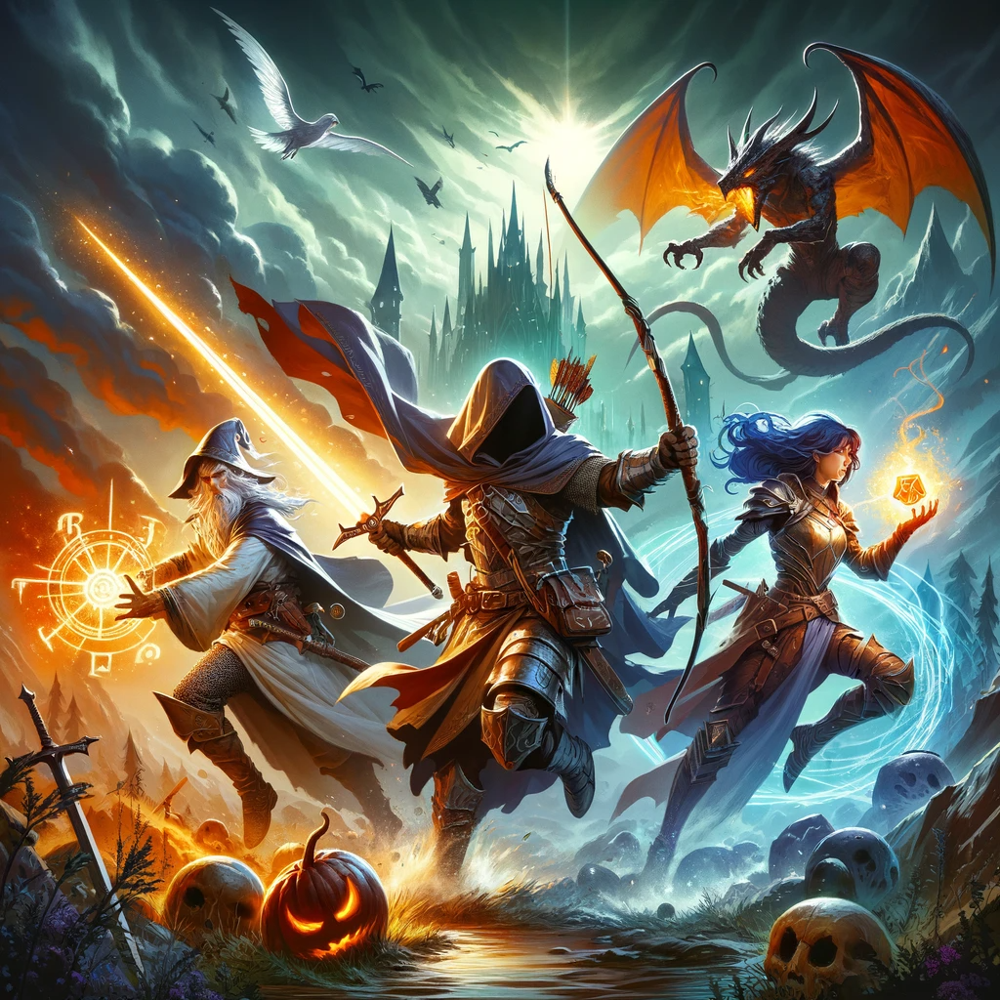

<h1 align="center">RPG Boss Fight</h1>
<h3 align="center">by ManuS</h3>
<h2 align="center">Grundlagen der Programmierung</h2>
<h3 align="center">Abschlussaufgabe RPG</h3>
 

  

## 1. Scenario

You control a party of three heroes: A Cleric, a Mage and a Warrior and have to defeat the Necromancer boss and his Golem.

## 2. Details

Each hero attacks in the order of your choice and then the enemies attack a random target with a random ability until one side is defeated.

### Information about the Heroes:

* The hero party consists of three heroes of three different classes: Cleric, Mage and Warrior
* The heroes have each have 4 different abilities
* The heroes have an item Inventory. \
The inventory contains multiple items with different abilities: 
    * 3x Health Potion: heals 50% of a heroes max. HP
    * 1x Elixir: increases a heroes permanently by 10%

### Information about the Boss and the Golem:

* The boss is a Necromancer who can summon a Golem when he drops below 50% max. HP
* The Necromancer abilities:
    * Death Wave: deals damage to each hero. 
    * Curse: can only affect one hero at a time **reduces the HP of the target by 10% of their max HP every turn until they reach 20% of their max HP**.
    * Vampiric Touch: drains a heros HP and heals the boss for the amount of damage dealt
    * Grievous Wounds: deals damage to a hero and prevents them from healing for one turn
    * Blight: deals a lot of damage to a hero
    * Summon Golem: summons a **Golem** once per game, when the boss drops **below 50% max HP**. It has less HP than the Necromancer and only 3 attacks. It attacks after the Necromancer each turn.
* Golem abilities:
    * Smash: deals a lot of damage to a hero
    * Ground Slam: deals damage to each hero
    * Taunt: forces the heroes to attack the Golem for the next 2 turns
